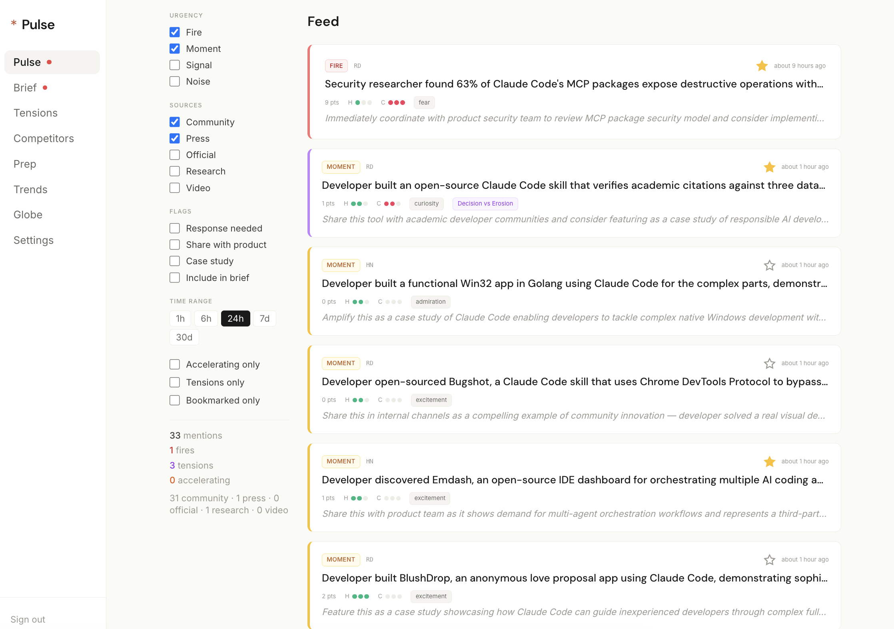
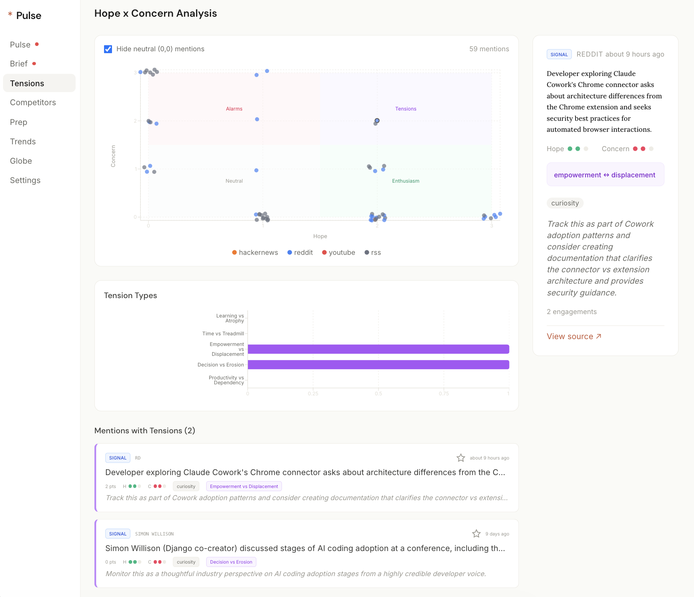
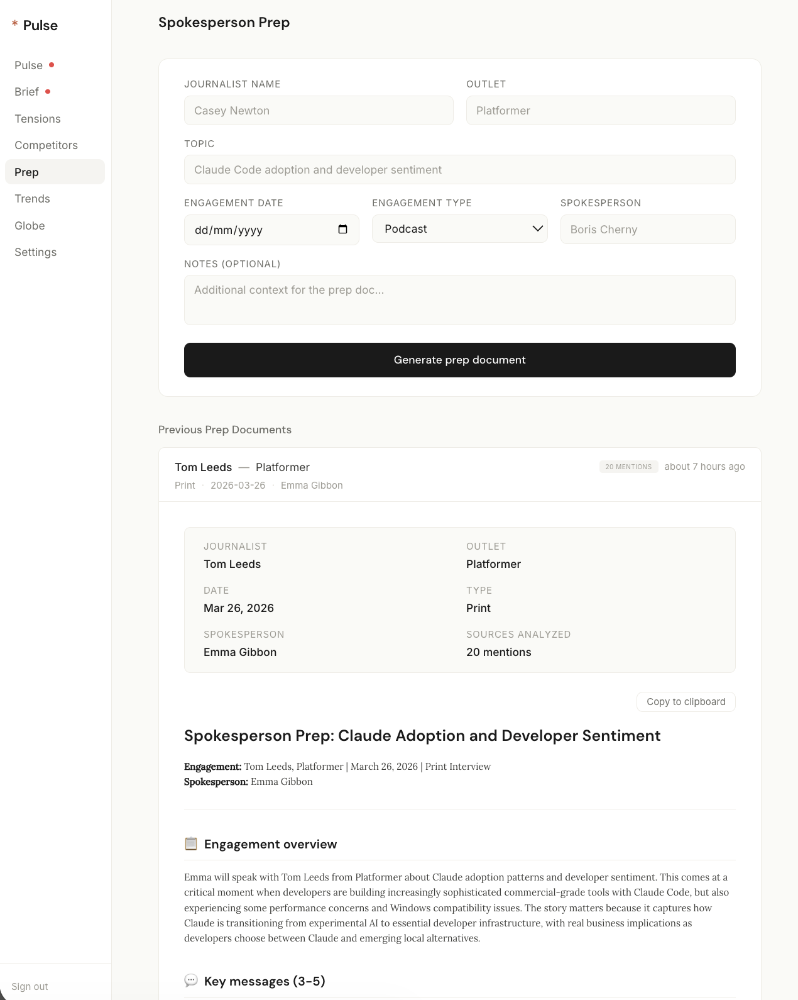

# Beacon

Developer comms intelligence. Monitors the platforms where developer sentiment actually forms, classifies every mention into actionable urgency tiers using Claude, and delivers triage-ready intelligence to a communications team.

**6 source platforms** — Hacker News, Reddit, Twitter/X, Discord, YouTube, and 32+ RSS feeds. See a story form on Twitter, spread to HN, hit Reddit, and appear in press — all in one unified timeline with cross-platform narrative propagation tracking.

**Classification accuracy:** 100% across 60+ mentions from HN, Reddit, and 32 RSS feeds. **Cost:** ~$40/month.

[Live dashboard](https://dailybeacon-one.vercel.app/dashboard/brief)<br>
[Demo](https://www.loom.com/share/3f3004ee19aa425fb030b72a5f46008d)<br>
[Design rationale & feature walkthrough (Notion)](https://www.notion.so/Beacon-32a152e1dde280f58a08ec68daf36d12?source=copy_link)
---

## Beacon in Action

#### Morning brief — three-section digest with fires, moments, and signals


#### Feed — real-time mentions with urgency classification, bookmarks, and triage filters



#### Tensions — hope x concern scatter plot with click-to-detail panel



#### Spokesperson prep — AI-generated briefing documents from accumulated intelligence


---

## What it does

Beacon ingests from 6 platforms every 30 minutes — Hacker News (Algolia API), Reddit (.json endpoints), Twitter/X (API v2), Discord (Bot API), YouTube (Data API v3), and 32+ RSS feeds spanning dev blogs, tech press, official channels, and research publications. Each mention passes through a Claude Sonnet classification pipeline that returns:

- **Urgency tier** — fire (respond in hours), moment (amplify within a day), signal (track over time), noise (log and ignore)
- **Hope and concern scores** — independent 0-3 axes, not binary sentiment. A developer who's excited about Claude Code but worried about skill decay scores high on both.
- **Tension type** — when hope >= 2 and concern >= 2, one of five named tensions: learning <-> atrophy, empowerment <-> displacement, time savings <-> treadmill, decision support <-> erosion, productivity <-> dependency
- **Primary emotion** — 12 categories (excitement, frustration, fear, admiration, curiosity, skepticism, etc.) calibrated for developer language where "kill," "crash," and "fatal" are neutral technical terms
- **Recommended action** — one-line next step for the comms team
- **Competitor detection** — flags mentions of Cursor, Copilot, Gemini CLI, Codex, Windsurf, Devin, Replit Agent
- **Audience routing** — auto-routes each mention to relevant internal teams (Product, Engineering, Safety, Policy, Executive) with 0-2 relevance scoring
- **Inferred region** — for regional sentiment analysis

The classifier uses 8 few-shot calibration examples grounded in real HN/Reddit posts, with categorical override rules (e.g., security bypass -> always fire, community build -> always moment) and intensity calibration based on SemEval-2018 affect research.

**Cross-platform propagation detection** — When a story appears on Twitter, spreads to Hacker News, and hits Reddit, Beacon automatically clusters these mentions and surfaces them as "Spreading Now" in the feed. Platform-colored timeline visualization shows the spread path, timing, and engagement at each node.

**Audience-specific briefs** — Route intelligence to Product, Engineering, Safety, Policy, and Executive teams. Each gets a daily brief tailored to their needs. Auto-classification routes mentions by relevance; manual tagging lets the comms team override.

**Narrative Command Center** — Set quarterly messaging priorities, track pull-through in press coverage over time, build journalist profiles with pitch guides, and detect emerging narratives from developer communities before they become crises.

**War Room Mode** — Fires auto-create incidents with pre-drafted responses from a template library, stakeholder notification checklists, collaborative draft editing with inline comments, and AI-generated post-incident reviews.

**LLM Output Monitoring** — Query ChatGPT, Gemini, Perplexity, and Claude daily with configurable probes. Track brand mention rates, narrative pull-through in AI responses, competitor positioning, and factual accuracy. Critical errors surface as fires — because millions of people get those answers daily.

---

## Dashboard

| Page | What it answers |
|------|-----------------|
| **War Room** | "There's a fire — what do we do?" — incident response workspace with auto-drafted responses, stakeholder tracking, and post-incident reviews. |
| **Feed** | "What's happening right now?" — filterable by urgency, source, time range, flags. Bookmark and flag mentions for triage workflow. "Spreading Now" section shows cross-platform propagation clusters. |
| **Brief** | "What do I need to know this morning?" — audience-specific briefs for Comms, Product, Engineering, Safety, Policy, and Executive with copy-to-Slack and history. |
| **Tensions** | "Where is developer sentiment conflicted?" — hope x concern scatter plot with click-to-detail panel. |
| **Competitors** | "What are developers saying about alternatives?" — mentions grouped by competitor with switching direction analysis. |
| **Prep** | "How do I prepare a spokesperson?" — generates briefing docs from accumulated intelligence: key messages, likely questions, landmines. |
| **Narratives** | "Narrative Command Center" — set strategic priorities, track pull-through trends, journalist intelligence, emerging narrative detection |
| **Trends** | "Is the narrative getting better or worse?" — sentiment trend, coverage distribution by source tier, top topics with week-over-week change, fire frequency. |
| **Regional** | "Are different markets talking about different things?" — world map with per-region narrative summaries, topic breakdowns, and active fires. |
| **LLM Intelligence** | "How do AI systems describe Anthropic and Claude?" — monitor how ChatGPT, Gemini, Perplexity, and Claude respond to configurable probes. Track brand mention rates, narrative pull-through, competitor positioning, and factual accuracy. Critical errors surface as fires. |

---

## Triage workflow

1. **Read** — scan the feed, sorted by urgency. Fire cards have red borders. Moments have amber.
2. **Save** — star mentions to bookmark them. Filter by "Bookmarked only" later.
3. **Route** — flag mentions and route to specific teams (Product, Engineering, Safety, Policy, Executive). Auto-classification routes by relevance; manual tagging overrides from the card dropdown.
4. **Act** — generate a spokesperson prep doc, copy the brief to Slack, or draft a response.

---

## Architecture

```
Layer 1: Signal ingestion
  HN (Algolia) + Reddit (.json) + Twitter/X (API v2) + Discord (Bot API)
  + YouTube (Data API) + 32 RSS feeds
  -> Cron every 30min via Vercel

Layer 2: Claude intelligence
  Claude Sonnet classifies each mention -> urgency, emotion, tension,
  hope/concern, competitor, region, recommended action
  -> Assistant prefill for reliable JSON parsing

Layer 2.5: Cross-platform propagation detection
  Keyword overlap clustering across platforms -> auto-cluster related mentions
  -> Rapid spread detection -> auto-promote to fire if 3+ platforms in 2 hours

Layer 3: Storage + enrichment
  Supabase Postgres -> engagement velocity snapshots every 30min
  -> Auto-promote to fire at 3x baseline engagement rate

Layer 4: Outputs
  Dashboard (Next.js 14) | Audience-specific briefs | Slack delivery
  | Fire alerts | Prep docs | Propagation timeline
```

**Stack:** Next.js 14 (App Router), Supabase (Postgres + Auth), Claude API (Sonnet), Vercel (deploy + cron), Tailwind CSS

**Cost:** ~$40/month at 100 mentions/day (API classification + Vercel + Supabase free tier)

---

## Research grounding

The classification system is informed by a developer comms intelligence market analysis compiled from 778 sources, plus:

- **Anthropic's 81K economic study** — hope and alarm coexist; someone excited about a benefit is 3x more likely to also fear the associated harm
- **Scherer's Component Process Model** — independent appraisal dimensions producing mixed emotional states
- **Stack Overflow Emotion Gold Standard** (Novielli et al.) — credibility inversely correlated with emotional intensity in developer text
- **Developer sentiment literature** (arXiv:2105.02703) — off-the-shelf sentiment tools perform poorly on developer language, necessitating domain-specific approaches
- **Cascade dynamics** (Goel, Anderson, Hofman, Watts) — early engagement breadth predicts virality; 99% of cascades terminate within one generation

Full market analysis of 14+ monitoring tools (Brandwatch, Meltwater, Common Room, Octolens, Syften, etc.) available in the Notion walkthrough.

---

## Roadmap (Ship in Next 30 Days)

- ~~**X/Twitter integration**~~ — shipped as a full source platform with monitored accounts, keyword search, and account category labels
- ~~**Discord integration**~~ — shipped with server/channel monitoring and thread/reaction tracking
- ~~**Cross-platform propagation tracking**~~ — shipped as "Spreading Now" with keyword-overlap clustering and platform timeline visualization
- **Slack bot with real-time fire alerts** — push notifications to the right channel the moment a fire is detected, not on the next cron cycle
- **Draft from selection** — select multiple mentions, generate a response draft, internal brief, or cross-functional report directly from the selected sources using Claude
- ~~**Message pull-through tracker**~~ — shipped as Narrative Command Center
- **Weekly intelligence digest** — auto-generated summary of fires fought, narratives tracked, and sentiment shifts, with resolution status for closed fires
- ~~**Cross-functional routing**~~ — shipped as Audience-Specific Intelligence Briefs
- ~~**War Room crisis management**~~ — shipped as War Room with auto-incident creation, stakeholder checklists, AI-drafted responses, and post-incident reviews


---

## Setup

### Prerequisites

Node.js 18+, Supabase project, Anthropic API key.

### Environment

```bash
cp .env.example .env.local
```

```
NEXT_PUBLIC_SUPABASE_URL=
NEXT_PUBLIC_SUPABASE_ANON_KEY=
SUPABASE_SERVICE_ROLE_KEY=
ANTHROPIC_API_KEY=
CRON_SECRET=
YOUTUBE_API_KEY=          # optional
SLACK_WEBHOOK_URL=        # optional
OPENAI_API_KEY=           # optional, for ChatGPT monitoring
GOOGLE_AI_API_KEY=        # optional, for Gemini monitoring
PERPLEXITY_API_KEY=       # optional, for Perplexity monitoring
TWITTER_BEARER_TOKEN=     # optional, for Twitter/X ingestion
DISCORD_BOT_TOKEN=        # optional, for Discord ingestion
```

### Database

Run migrations in order:

```sql
supabase/migrations/001_initial.sql
supabase/migrations/002_prep_documents.sql
supabase/migrations/006_audiences.sql
supabase/migrations/007_narratives.sql
supabase/migrations/008_llm_monitoring.sql
supabase/migrations/009_twitter_discord_propagation.sql
```

### Run

```bash
npm install
npm run dev
```

### Ingest and classify

```bash
curl -X POST http://localhost:3001/api/ingest/hackernews
curl -X POST http://localhost:3001/api/ingest/reddit
curl -X POST http://localhost:3001/api/ingest/rss
curl -X POST http://localhost:3001/api/ingest/twitter
curl -X POST http://localhost:3001/api/ingest/discord
curl -X POST http://localhost:3001/api/classify
curl -X POST http://localhost:3001/api/velocity
curl -X POST http://localhost:3001/api/brief
```

### Deploy

Deploy to Vercel. Set environment variables. The cron schedule is configured in `vercel.json`.

---

## API

| Route | Method | Description |
|-------|--------|-------------|
| `/api/cron` | POST | Full pipeline: ingest -> classify -> propagation -> velocity -> alerts -> brief |
| `/api/ingest` | POST | All source ingestions |
| `/api/ingest/hackernews` | POST | HN only |
| `/api/ingest/reddit` | POST | Reddit only |
| `/api/ingest/rss` | POST | RSS feeds only |
| `/api/ingest/twitter` | POST | Twitter/X only |
| `/api/ingest/discord` | POST | Discord only |
| `/api/classify` | POST | Classify unclassified mentions via Claude |
| `/api/velocity` | POST | Engagement velocity snapshots |
| `/api/brief` | POST | Generate daily brief |
| `/api/mentions` | GET | Filtered, paginated mention feed |
| `/api/mentions/[id]` | PATCH | Update bookmark, flag, review status |
| `/api/prep` | POST/GET | Generate or list spokesperson prep documents |
| `/api/audiences` | GET/PUT | List audiences, update audience config |
| `/api/briefs/audience` | POST | Generate audience-specific briefs |
| `/api/briefs/audience/[slug]` | GET | Fetch brief by audience (?history=true, ?date=) |
| `/api/briefs/audience/deliver` | POST | Deliver briefs to Slack webhooks |
| `/api/narratives` | GET/POST | List/create narrative priorities |
| `/api/narratives/[slug]` | GET/PUT/DELETE | Narrative details, update, deactivate |
| `/api/narratives/gaps` | GET/PATCH | Emerging narrative gaps |
| `/api/narratives/snapshots` | GET/POST | Weekly pull-through snapshots |
| `/api/narratives/report` | GET/POST | Weekly narrative intelligence report |
| `/api/journalists` | GET | Journalist profiles with alignment data |
| `/api/journalists/[slug]` | GET/PUT | Individual journalist detail and notes |
| `/api/sources/tiers` | GET | Source tier configuration and metadata |
| `/api/sources/twitter/accounts` | GET/POST/PUT/DELETE | Monitored Twitter accounts |
| `/api/sources/twitter/keywords` | GET/POST/PUT | Twitter search keywords |
| `/api/sources/discord/channels` | GET | Monitored Discord channels |
| `/api/sources/propagation` | GET/POST | Cross-platform propagation clusters |
| `/api/sources/propagation/[id]` | GET/PUT | Cluster detail with platform timeline |
| `/api/llm-monitor/probes` | GET/POST/PUT/DELETE | Manage LLM monitoring probes |
| `/api/llm-monitor/responses` | GET | Paginated LLM responses with classifications |
| `/api/llm-monitor/responses/[id]` | GET | Single response detail |
| `/api/llm-monitor/snapshots` | GET/POST | Weekly monitoring snapshots |
| `/api/llm-monitor/run` | POST | Trigger LLM monitoring run |

---

*Built with Claude Code. 5 parallel agents. 1 week.*
