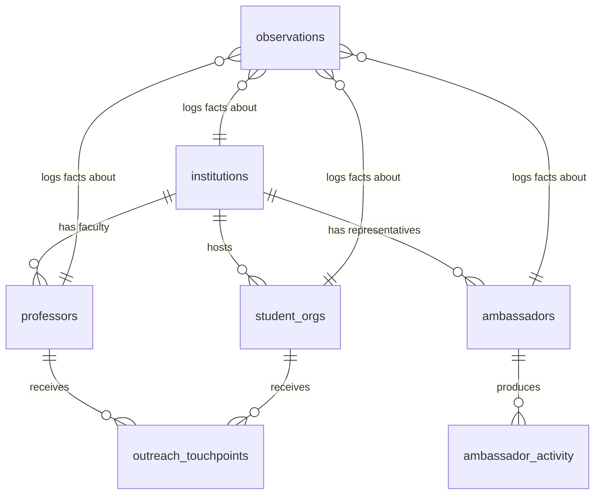

# Beacon Schema

## Core principle

One append-only `observations` table is the source of truth for every fact about every entity. Entity tables (`institutions`, `professors`, `ambassadors`, `student_orgs`, `outreach_touchpoints`) store current state, but every mutation writes an observation row. Current state can be rebuilt from observations alone.

## ER diagram

## Tables

### `institutions` (reference)
- `id` text primary key (slug, e.g., "mit", "stanford")
- `name` text not null
- `country` text not null
- `cs_program_tier` int (1=top-10, 2=top-25, 3=top-50)
- `sheerid_supported` bool
- `created_at` timestamptz
- Rationale: Reference entity for joins. Slug-based IDs so URLs are human-readable.

### `professors` (operational)
- `id` text primary key (slug, e.g., "sasha-rush")
- `institution_id` text fk → institutions.id
- `name` text not null
- `title` text (e.g., "Associate Professor")
- `lab_name` text nullable
- `arxiv_author_id` text nullable
- `homepage_url` text nullable
- `recent_relevant_papers_count` int default 0
- `ai_stance_quote` text nullable — VERBATIM quote, not inference
- `ai_stance_source_url` text nullable
- `public_statements` jsonb default '[]' — array of {quote, source_url, date}
- `last_enriched_at` timestamptz
- Rationale: Current-state table for rendering. Every field here is derived from observations and re-derivable at any time.

### `ambassadors` (operational)
- `id` uuid primary key
- `institution_id` text fk → institutions.id
- `email` text not null
- `name` text not null
- `github_username` text
- `application_data` jsonb — full Typeform submission
- `score` jsonb — {research_alignment, student_reach, adoption_signal, network_influence, total}
- `stage` text — enum: applied / under_review / accepted / rejected / onboarding / active / slowing / inactive
- `health_score` int — 0-100, computed from recent activity
- `accepted_at` timestamptz nullable
- `last_active_at` timestamptz nullable
- Rationale: Central ambassador CRM entity. Stage machine drives workflow.

### `student_orgs` (reference)
- `id` text primary key (slug, e.g., "mit-acm")
- `institution_id` text fk
- `name` text
- `org_type` text — "acm_chapter" / "ieee_chapter" / "hackathon_org" / "ai_club" / "other"
- `contact_email` text nullable
- `leader_name` text nullable
- Rationale: Outreach target entity separate from professors.

### `outreach_touchpoints` (operational)
- `id` uuid primary key
- `target_type` text — "professor" / "student_org"
- `target_id` text
- `stage` text — cold / contacted / meeting_booked / demo_held / partnership_active / dead
- `channel` text — "email" / "meeting" / "event"
- `draft_content` text
- `sent_at` timestamptz nullable
- `reply_detected_at` timestamptz nullable
- `notes` text
- Rationale: CRM pipeline tracking for Feature 5.

### `observations` (APPEND-ONLY, source of truth)
- `id` uuid primary key
- `entity_type` text — "institution" / "professor" / "ambassador" / "student_org" / "outreach"
- `entity_id` text
- `observation_type` text — enum of ~25 types (see data-contracts.md)
- `payload` jsonb — the actual fact being logged
- `source` text — "arxiv" / "github" / "sheerid" / "manual" / "typeform" / "syllabus_scrape" / "serpapi" / "classification"
- `source_url` text nullable
- `confidence` real — 0.0 to 1.0
- `observed_at` timestamptz not null default now()
- `created_at` timestamptz not null default now()
- Indexes: (entity_type, entity_id, observed_at desc), (observation_type, observed_at desc)
- Rationale: Every fact flows here. Never update, never delete. New observations supersede old ones.

### `ingestion_logs` (audit)
- `id` uuid primary key
- `source` text — "arxiv" / "github" / "mlh" / "university_directory" / "serpapi"
- `entity_type` text nullable
- `entity_id` text nullable
- `started_at` timestamptz
- `completed_at` timestamptz nullable
- `items_processed` int default 0
- `items_new` int default 0
- `error` text nullable
- Rationale: Per-source pipeline audit (ported from Pulse).

### `classifications` (audit)
- `id` uuid primary key
- `entity_type` text
- `entity_id` text
- `classifier_name` text — e.g., "keyword_match_llm_papers"
- `input_hash` text
- `output` jsonb
- `model` text nullable
- `prompt_version` text nullable
- `created_at` timestamptz
- Rationale: Cache + audit. Idempotent classifications, avoid re-processing same input.

### `institution_user_mappings` (operational, Feature 8)
- `id` uuid primary key
- `cursor_user_id` text
- `institution_id` text fk
- `confidence` real
- `signals` jsonb — array of {signal_type, value, weight}
- `verified` bool default false
- Rationale: Identity resolution output.

### `entity_snapshots` (audit, weekly)
- `id` uuid primary key
- `entity_type` text
- `entity_id` text
- `snapshot_date` date
- `state` jsonb — full entity state at that date
- Rationale: Time-series for Monday Workqueue "what changed" diffs (ported from Pulse).

### `actions_log` (audit, Feature 9 and 10)
- `id` uuid primary key
- `action_type` text — "outreach_drafted" / "application_reviewed" / "ambassador_onboarded" / "question_answered"
- `target_type` text
- `target_id` text
- `performed_at` timestamptz
- `context` jsonb
- Rationale: Feeds Monday Workqueue and Quarterly Review attribution narrative.

## Tables added by parallel agents

### `events` (operational, owned by Event Toolkit agent)
- `id` uuid primary key
- `institution_id` text fk → institutions.id
- `ambassador_id` uuid fk → ambassadors.id nullable
- `event_type` text — enum: cafe_cursor / hackathon_sponsorship / 
  workshop / lab_demo / professor_talk
- `title` text not null
- `scheduled_at` timestamptz
- `status` text — draft / scheduled / completed / cancelled
- `tracking_code` text unique — for attribution to signups
- `attendee_count` int default 0
- `notes` text
- `created_at` timestamptz
- Rationale: Event lifecycle entity. Tracking_code links event to 
  downstream signups for activation attribution.

### `event_attendees` (operational, owned by Event Toolkit agent)
- `id` uuid primary key
- `event_id` uuid fk → events.id
- `email` text not null
- `name` text nullable
- `attended_at` timestamptz
- `activated_at` timestamptz nullable — when they first used Cursor 
  post-event
- Rationale: Attendance log. Activated_at populated by post-event 
  attribution job.

### `resource_views` (audit, owned by Resource Hub agent)
- `id` uuid primary key
- `resource_slug` text — e.g., "cafe-cursor-playbook"
- `viewer_id` text — ambassador uuid or "anonymous"
- `viewed_at` timestamptz
- `time_on_page_seconds` int nullable
- Rationale: Track resource usage to detect dead content.

### `verification_attempts` (operational, owned by Discount Provisioning agent)
- `id` uuid primary key
- `email` text not null
- `country` text
- `claimed_institution` text nullable
- `sheerid_response_code` text
- `status` text — pending / approved / rejected / manual_review
- `reviewed_by` text nullable
- `reviewed_at` timestamptz nullable
- `notes` text
- `created_at` timestamptz
- Rationale: SheerID integration log + manual override workflow for 
  edge cases (Indian/Romanian students, etc).

## What's immutable vs. re-derivable

- **Immutable:** raw ingestion payloads (stored in observations with source), user-submitted content.
- **Re-derivable:** every field on `professors`, `ambassadors`, `student_orgs`. Recompute from observations.

